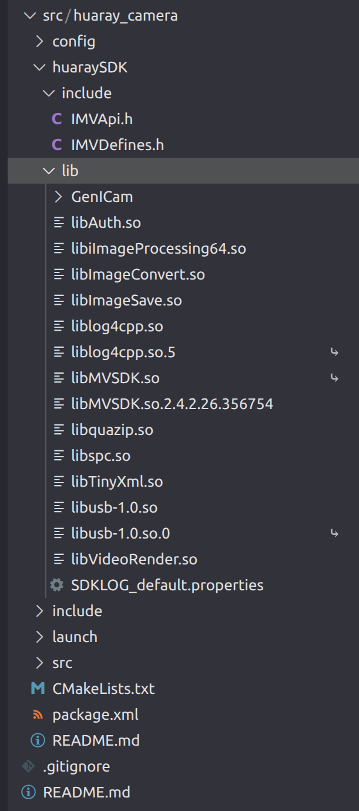

# 2.1

我们RoboMaster战队内部的海康工业相机疑似不够了。翻找仓库发现了一个学长留下来的华睿科技A5131CU210，分辨率与采集帧率略低，但应该够用了。

于是我决定写一版功能基本一致的基于ROS2的华睿相机驱动。

下载华睿相机的GUI工具，发现华睿科技官方并没有发布打包好的c/c++SDK，于是从GUI工具的动态库里截取一部分文件作为这次开发的SDK。

```bash
bandiera@BR:/opt/HuarayTech/MVviewer$ ls
bin  include  lib  license  module  share
bandiera@BR:/opt/HuarayTech/MVviewer$ ls include/
IMVApi.h  IMVDefines.h
bandiera@BR:/opt/HuarayTech/MVviewer$ ls lib
GenICam                   libMVSDK.so.2.4.2.26.356754
libAuth.so                libquazip.so
libiImageProcessing64.so  libspc.so
libImageConvert.so        libTinyXml.so
libImageSave.so           libusb-1.0.so
liblog4cpp.so             libusb-1.0.so.0
liblog4cpp.so.5           libVideoRender.so
libMVSDKGuiQt.so          Qt
libMVSDKGuiQt.so.1        SDKLOG_default.properties
libMVSDK.so
```

将以上文件打包至项目根目录。



查找API文档，编写与原海康相机驱动行为一致的代码。

关键函数：

```c++
bool HuarayCameraNode::Read(cv::Mat& img, rclcpp::Time& timestamp)
{
  if (state_.load() == HuarayStateEnum::STOPPED || handle_ == nullptr ||
      !is_grabbing_.load())
  {
    return false;
  }

  IMV_Frame frame{};
  int ret{};
  unsigned int n_msec = 100;

  auto start = std::chrono::steady_clock::now();
  ret = IMV_GetFrame(handle_, &frame, n_msec);

  if (ret != IMV_OK)
  {
    if (ret == IMV_TIMEOUT)
    {
      return false;
    }
    RCLCPP_ERROR(this->get_logger(), "IMV_GetFrame failed: 0x%X, switching to Stopped.",
                 ret);
    state_.store(HuarayStateEnum::STOPPED);
    guard_.is_quit.notify_all();
    return false;
  }

  auto now = std::chrono::steady_clock::now();
  auto duration_ns = std::chrono::duration_cast<std::chrono::nanoseconds>(now - start);
  if (duration_ns < std::chrono::nanoseconds(2'000'000))
  {
    IMV_ReleaseFrame(handle_, &frame);
    return false;
  }

  timestamp = this->now();

  cv::Mat raw_img(cv::Size(static_cast<int>(frame.frameInfo.width),
                           static_cast<int>(frame.frameInfo.height)),
                  CV_8U, frame.pData);

  const auto& frame_info = frame.frameInfo;
  auto pixel_type = frame_info.pixelFormat;

  static const std::unordered_map<IMV_EPixelType, int> TYPE_MAP = {
      {gvspPixelBayGR8, cv::COLOR_BayerGR2BGR},
      {gvspPixelBayRG8, cv::COLOR_BayerRG2BGR},
      {gvspPixelBayGB8, cv::COLOR_BayerGB2BGR},
      {gvspPixelBayBG8, cv::COLOR_BayerBG2BGR}};

  auto it = TYPE_MAP.find(pixel_type);
  if (it == TYPE_MAP.end())
  {
    RCLCPP_WARN(this->get_logger(), "Unsupported pixel format: 0x%X", pixel_type);
    IMV_ReleaseFrame(handle_, &frame);
    state_.store(HuarayStateEnum::STOPPED);
    guard_.is_quit.notify_all();
    return false;
  }

  cv::Mat dst_image;
  cv::cvtColor(raw_img, dst_image, it->second);
  img = dst_image;

  ret = IMV_ReleaseFrame(handle_, &frame);
  if (ret != IMV_OK)
  {
    RCLCPP_ERROR(this->get_logger(),
                 "IMV_ReleaseFrame failed: 0x%X, switching to Stopped.", ret);
    state_.store(HuarayStateEnum::STOPPED);
    guard_.is_quit.notify_all();
    return false;
  }

  return true;
}
```

```c++
void HuarayCameraNode::ProtectRunning()
{
  RCLCPP_INFO(this->get_logger(), "Protect thread started.");

  std::this_thread::sleep_for(std::chrono::milliseconds(500));

  std::unique_lock<std::mutex> lock(this->guard_.mux);
  while (running_.load())
  {
    this->guard_.is_quit.wait_for(
        lock, std::chrono::milliseconds(500),
        [this]
        {
          return (this->state_.load() == HuarayStateEnum::STOPPED) ||
                 (!this->running_.load());
        });

    if (!this->running_.load())
    {
      break;
    }

    if (this->state_.load() == HuarayStateEnum::STOPPED)
    {
      RCLCPP_INFO(this->get_logger(), "Camera stopped, attempting to restart...");
      this->CaptureStop();

      std::this_thread::sleep_for(std::chrono::seconds(2));

      if (!this->running_.load())
      {
        break;
      }

      this->CaptureInit();

      if (this->state_.load() == HuarayStateEnum::STOPPED)
      {
        RCLCPP_WARN(this->get_logger(),
                    "Camera restart failed, will retry in 5 seconds...");
        std::this_thread::sleep_for(std::chrono::seconds(5));
      }
    }
  }
  RCLCPP_INFO(this->get_logger(), "Protect thread exit.");
}
```

编译：

```bash
bandiera@BR:~/Desktop/huaray_camera$ colcon build --symlink-install
Starting >>> huaray_camera
--- stderr: huaray_camera                              
CMake Deprecation Warning at CMakeLists.txt:1 (cmake_minimum_required):
  Compatibility with CMake < 3.10 will be removed from a future version of
  CMake.

  Update the VERSION argument <min> value.  Or, use the <min>...<max> syntax
  to tell CMake that the project requires at least <min> but has been updated
  to work with policies introduced by <max> or earlier.


In this package, headers install destination is set to `include` by ament_auto_package. It is recommended to install `include/huaray_camera` instead and will be the default behavior of ament_auto_package from ROS 2 Kilted Kaiju. On distributions before Kilted, ament_auto_package behaves the same way when you use USE_SCOPED_HEADER_INSTALL_DIR option.
---
Finished <<< huaray_camera [2.80s]

Summary: 1 package finished [3.03s]
  1 package had stderr output: huaray_camera
```

无报错，提交。

[提交链接]: https://github.com/BandieraRosa/huaray_camera/commit/abec45c31779504c4a3ef7dada14f8da1214672d
[仓库链接]: https://github.com/BandieraRosa/huaray_camera
[个人主页]: https://github.com/BandieraRosa

欢迎 Star 与 Follow。