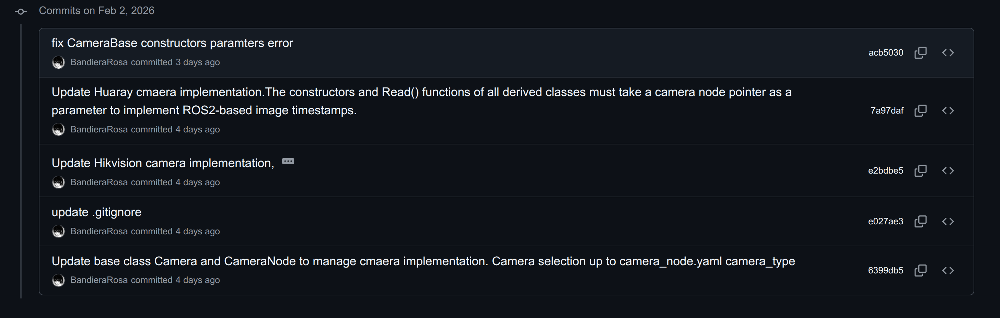

# 2.2

既然已经有了多个相机节点包，那为什么不能再抽象一层通用相机类，按照所需动态加载不同的相机类实现？

查询ROS2文档，发现了一个适用于运行时多态的机制：Plugin——插件功能。

Plugin支持在运行时根据需要加载不同的实现，仅需通过xml插件定义即可关联不同包之间对应的基类与派生类。

首先定义相机基类 `CameraBase`，提供统一的接口规范：

```c++
class CameraBase
{
 public:
  using Ptr = std::shared_ptr<CameraBase>;
  
  CameraBase() = default;
  CameraBase(rclcpp::Node* node) : node_(node) {}
  virtual ~CameraBase() = default;

  // 核心接口
  virtual bool Initialize() = 0;
  virtual void Stop() = 0;
  virtual bool Read(cv::Mat& image, rclcpp::Time& timestamp_ns) = 0;
  virtual CameraState GetState() const = 0;
  virtual void SetParams(const CameraParams& params) = 0;
  
  // 参数设置接口
  virtual void SetFloatValue(const std::string& name, double value) = 0;
  virtual void SetEnumValue(const std::string& name, unsigned int value) = 0;
  
  // 工具函数
  void SetNode(rclcpp::Node* node) { node_ = node; }
  void SetLogCallback(LogCallback callback) { log_callback_ = std::move(callback); }

 protected:
  LogCallback log_callback_;
  rclcpp::Node* node_{nullptr};
};
```

相机节点负责插件加载和管理：

```c++
CameraNode::CameraNode(const rclcpp::NodeOptions& options)
    : rclcpp::Node("camera_node", options)
{
  InitializeParams();
  
  // 加载相机驱动插件
  if (!LoadCameraPlugin())
  {
    RCLCPP_FATAL(this->get_logger(), "Failed to load camera plugin!");
    throw std::runtime_error("Failed to load camera plugin");
  }
  
  SetupLogCallback();
  InitializeCamera();
  
  // 创建守护线程和采集线程
  guard_.protect_thread = std::thread(&CameraNode::ProtectRunning, this);
  capture_thread_ = std::thread(&CameraNode::CaptureLoop, this);
}

```

海康相机驱动的插件描述文件：

```xml
<library path="hik_camera_driver">
  <class type="HikCamera::HikCamera" base_class_type="Camera::CameraBase">
    <description>HIK industrial camera driver</description>
  </class>
</library>
```

编译：

```bash
bandiera@BR:~/Desktop/camera$ colcon build --symlink-install
Starting >>> camera_node
--- stderr: camera_node                              
CMake Deprecation Warning at CMakeLists.txt:1 (cmake_minimum_required):
  Compatibility with CMake < 3.10 will be removed from a future version of
  CMake.

  Update the VERSION argument <min> value.  Or, use the <min>...<max> syntax
  to tell CMake that the project requires at least <min> but has been updated
  to work with policies introduced by <max> or earlier.


In this package, headers install destination is set to `include` by ament_auto_package. It is recommended to install `include/camera_node` instead and will be the default behavior of ament_auto_package from ROS 2 Kilted Kaiju. On distributions before Kilted, ament_auto_package behaves the same way when you use USE_SCOPED_HEADER_INSTALL_DIR option.
---
Finished <<< camera_node [4.10s]
Starting >>> hik_camera
Starting >>> huaray_camera
--- stderr: hik_camera                                                                            
CMake Deprecation Warning at CMakeLists.txt:1 (cmake_minimum_required):
  Compatibility with CMake < 3.10 will be removed from a future version of
  CMake.

  Update the VERSION argument <min> value.  Or, use the <min>...<max> syntax
  to tell CMake that the project requires at least <min> but has been updated
  to work with policies introduced by <max> or earlier.


---
Finished <<< hik_camera [2.25s]
--- stderr: huaray_camera                           
CMake Deprecation Warning at CMakeLists.txt:1 (cmake_minimum_required):
  Compatibility with CMake < 3.10 will be removed from a future version of
  CMake.

  Update the VERSION argument <min> value.  Or, use the <min>...<max> syntax
  to tell CMake that the project requires at least <min> but has been updated
  to work with policies introduced by <max> or earlier.


---
Finished <<< huaray_camera [2.32s]

Summary: 3 packages finished [6.67s]
  3 packages had stderr output: camera_node hik_camera huaray_camera
```

无报错，提交。

